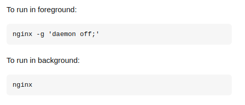

# Docker stage

## Vue.js

The dockerfile is located in the root of the project. The dockerfile is used to build the image for the Vue.js application. The image is built using the following command:

```bash
# build the image
docker build -t vuejs-app .
# and run it with
docker run -it -p 8080:8080 --rm --name vuejs-app vuejs-app
# if you don't want to run the container in interactive mode, you can run it in detached mode with
docker run -p 8080:8080 vuejs-app
```


## React.js

THe dockerfile is located in the root of the project. The dockerfile is used to build the image for the React.js application. The image is built using the following command:

```bash
# build the image
docker build -t reactjs-app .
# and run it with
docker run -it -p 3000:3000 --rm --name reactjs-app reactjs-app
# if you don't want to run the container in interactive mode, you can run it in detached mode with
docker run -p 3000:3000 reactjs-app
```